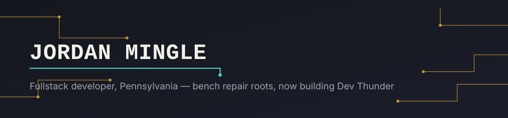

Fullstack developer in Pennsylvania. I've been building on the web since 2014 — team-based development, solo freelance, and now running my own company, **Dev Thunder**.

I build in **Ruby on Rails** and **Svelte & SvelteKit** with **TypeScript** (one stack per project), maintain long-running **WordPress** sites, and style with **CSS / Tailwind / Sass**. Nearly two decades of hands-on technical work, from bench-level hardware repair to shipping production apps end-to-end.

<p align="left">
  
  
  
  
  
  <br/>
  
  
  
  
  
</p>


### 🔧 What I work on

```
$ bench --readout

[OK]  Rails & APIs        ActiveRecord, background jobs, auth
[OK]  Svelte / SvelteKit  Type-safe fullstack apps, TypeScript
[OK]  UI & styling        Accessible CSS, Tailwind, Sass
[OK]  WordPress           Long-term client sites, maintained for years
[OK]  Infrastructure      Domains, hosting, SSL, deploy pipeline
```


### 🛠️ How I got here

1. **2008 – Eastside Computer** — retail and bench work: triage, diagnostics, parts sourcing. Learned how hardware actually fails.
2. **2014 – My Domain Labs** — team-based web development: client sites, hosting, domains, SSL, deploys.
3. **2017 – Jordan Mingle Web Designs** — went solo, running freelance client work in parallel with the team job.
4. **2021 – Dev Thunder** — founded my own company, now building toward combined hosting + development.


### 📊 GitHub stats

<div align="center">
  
  
</div>

<div align="center">
  
</div>


### 🚀 Featured projects

<table>
<tr>
<td width="33%" valign="top">

**[Rizzo CSS](https://rizzo-css.vercel.app/)**

My own CSS design system — 34 accessibility-first components (WCAG AA), 14 OKLCH themes, full keyboard/ARIA support. Published on npm.

`CSS` `PostCSS` `Astro`

[GitHub](https://github.com/mingleusa/rizzo-css) · [npm](https://www.npmjs.com/package/rizzo-css)

</td>
<td width="33%" valign="top">

**[Mazzullo's](https://mazzullos.com/)**

WordPress site for a detailing shop — built and maintained 10+ years and counting.

`WordPress` `Long-term maintenance`

</td>
<td width="33%" valign="top">

**[Gunopoly](https://gunopoly.com/)**

A classifieds marketplace: browse, filter, sign in, and post listings.

`Rails` `Hotwire` `Tailwind`

</td>
</tr>
</table>


### 🏢 Dev Thunder

`[●] status: building — full-stack dev now, hosting coming online`

My own company — currently full-stack development, building toward a combined web hosting and development offering. Working with local clients across north-central Pennsylvania and remote collaborators.


### 📫 Get in touch

<p align="left">
  <a href="mailto:hello@jordanmingle.dev"></a>
  <a href="https://www.linkedin.com/in/jordanmingle/"></a>
</p>
